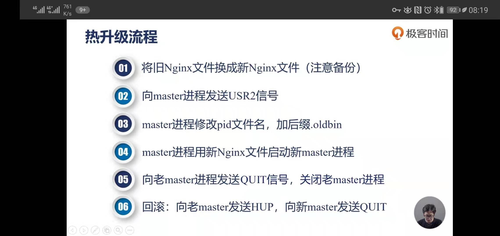

# Nginx知识学习

## Nginx信号

$(NginxMasterPID)：表示Nginx Master进程ID

### Nginx优雅停止服务：
```
kill -QUIT $(NginxMasterPID) 
或
nginx -s quit
```

### Nginx立即停止服务：
```
kill -TERM $(NginxMasterPID) 
或
kill -INT $(NginxMasterPID) 
或
nginx -s stop
```

### Nginx重载配置文件(work进程会重启)：
```
kill -HUP $(NginxMasterPID)
或
nginx -s reload
```

### Nginx重新开始记录日志文件(reopen)：
```
kill -USR1 $(NginxMasterPID)
或
nginx -s reopen
```


### Nginx热升级



```
mv nginx nginx.old
kill -USR2 $(NginxMasterPID) 
kill -WINCH $(NginxMasterPID)

//这个时候旧的Master进程还是存在的：
//要退出旧master进程，发送：kill -QUIT $(NginxMasterPID)
//版本回退，发送：kill -HUP $(NginxMasterPID)
```


